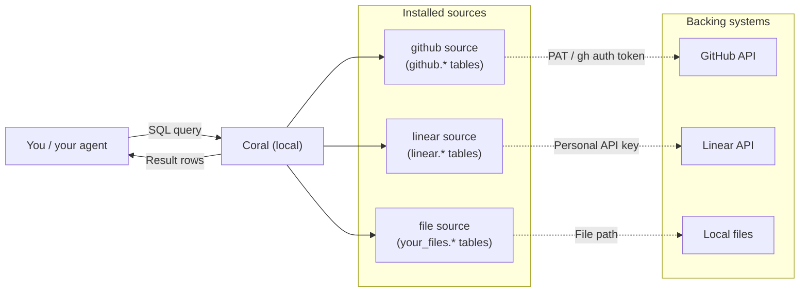

With Coral, agents can make fewer, more precise tool calls, as a result it is more efficient than using individual MCP servers, CLI tools or API wrappers. It has support for a number of [popular data sources](/reference/bundled-sources) bundled in, and you can easily extend it to accommodate others by writing your own [source specs](/reference/source-spec-reference). You can run SQL from the [CLI](/reference/cli-reference) or through [MCP](/guides/use-coral-over-mcp). And everything is local; your data, credentials and usage history never leave your machine.

## Get started

<Steps titleSize="h3">
  <Step title="Install Coral">
    Install the Coral CLI to get started.

    ```shellscript
    brew install withcoral/tap/coral
    ```

    [See all installation options](/getting-started/installation)

  </Step>

  <Step title="Add your sources">
   Connect GitHub, Slack, Datadog, and other [bundled sources](/reference/bundled-sources) to your workspace. For example:

    ```shellscript
    coral source add github
    ```

    [Go to the quickstart](/getting-started/quickstart)

  </Step>

  <Step title="Start querying">
    Write SQL directly or let your AI agent query on your behalf.

    ```shellscript
    coral sql "SELECT name, stargazers_count FROM github.org_repos WHERE org = 'withcoral' ORDER BY stargazers_count DESC"
    ```

    [Or use Coral over MCP](/guides/use-coral-over-mcp)

  </Step>
</Steps>

## How Coral works

Coral sits between you and your data sources: you (or your agent) write SQL, and Coral translates it into API calls or file reads, then returns a single query result.

A **source spec** is a YAML file that defines how to reach an API or local dataset and which tables/columns it exposes. A **source** is a data source Coral can query, created from a source spec plus your configured credentials and variables. When you run `coral source add github`, Coral installs the `github` source. At query time, Coral loads that source as the `github` SQL schema, so tables like `github.issues` and `github.pull_requests` are queryable. Start with [bundled sources](/reference/bundled-sources) or [write your own](/guides/write-a-custom-source).

During `source add`, Coral prompts for declared variables and secrets (tokens, workspace IDs, file paths, etc.). These are stored locally in Coral state, with secrets kept separately from non-secret config, and used only at query time. Because each source appears as SQL tables, you can `JOIN` across sources in one statement (for example `github.issues` with `linear.attachments`), and Coral executes that locally on your machine.



For the full internals, crates, gRPC transport, DataFusion integration, see the [architecture page](/contributors/architecture).

## Quick links

<CardGroup cols={2}>
  <Card title="Use Coral over MCP" href="/guides/use-coral-over-mcp">
    Set up MCP for Claude Code, Cursor, and other agents
  </Card>
  <Card title="Write a custom source" href="/guides/write-a-custom-source">
    Connect any API or dataset to Coral
  </Card>
  <Card title="Bundled sources" href="/reference/bundled-sources">
    GitHub, Slack, Stripe, and more
  </Card>
  <Card title="Source spec reference" href="/reference/source-spec-reference">
    Full YAML field reference for source specs
  </Card>
</CardGroup>
